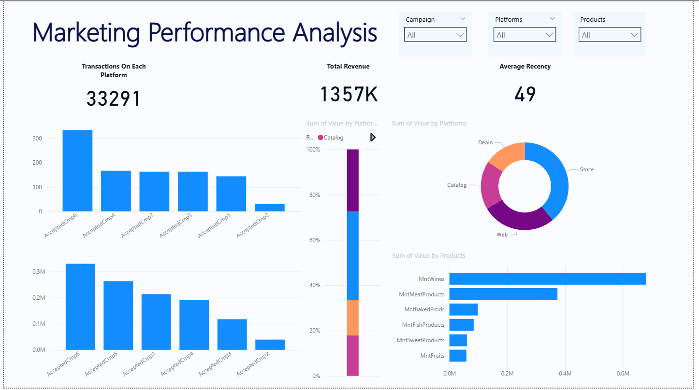

# Marketing Performance Analysis  
**EDA + Power BI Dashboard**



**🔍 Project Overview**  
Comprehensive Exploratory Data Analysis and interactive Power BI dashboard for a real-world **marketing campaign dataset**.  
The goal was to understand customer behavior, evaluate the performance of 6 marketing campaigns + "Response", identify high-value segments, and deliver clear business recommendations.

**📊 What I Delivered**  
- Full EDA in Python (Seaborn + Matplotlib + SciPy)  
- Statistical tests (t-test, ANOVA, Chi²) to validate campaign impact  
- Clean data model in Power BI with DAX measures  
- Professional interactive dashboard for stakeholders  

---

### 🛠️ Tech Stack
| Layer          | Tools                                     |
|----------------|-------------------------------------------|
| Language       | Python 3                                  |
| Analysis       | Pandas, NumPy, SciPy                      |
| Visualization  | Seaborn, Matplotlib                       |
| Dashboard      | Power BI (Data Model + DAX)               |
| Environment    | Jupyter Notebook                          |

---

### 📈 Key Insights

**Customer Profile**  
- Majority of clients are **Married** or **Together**  
- Peak birth years: **1970s** (most active customers)  
- Median income ≈ **50-80k**; clients **without children** have significantly higher income  

**Spending Behavior**  
- **Wine** and **Meat Products** dominate spending  
- Purchase distribution is heavily right-skewed → small group of high spenders  
- Store purchases > Web > Catalog (in volume)  

**Campaign Performance**  
| Campaign     | Acceptance Rate | Impact on Total Spend (p-value) |
|--------------|------------------|---------------------------------|
| Response     | Highest          | **Highly significant**          |
| AcceptedCmp6 | Strong           | **Highly significant**          |
| AcceptedCmp2 | Very low         | Weak / not significant          |

**Statistical Findings**  
- All campaigns except Cmp2 show **statistically significant impact** on total amount spent (p < 0.05)  
- No significant relationship between Education and Country  
- Strong association between Education level and number of kids at home  

---

### 🖼️ Visual Highlights

**Python EDA**  
- Year of birth distribution + boxplot  
- Campaign acceptance bar chart  
- Marital status breakdown  
- Spending distribution per product category (facet grid)  
- Purchase channels comparison  
- Income vs Kidhome / Teenhome boxplots  

**Power BI Dashboard**  
- Marketing Performance Analysis (main page)  
- Campaign performance bar charts  
- Sum of Value by Platforms (donut chart)  
- Sum of Value by Products (horizontal bar)  
- Clean star schema data model (Campaign, Product, Platform tables + measures)

*(All visuals are included in the `assets/` folder and notebook)*

---

### 💼 Business Recommendations
1. **Stop or redesign** Campaign 2 – very low ROI  
2. **Double down** on Campaign 6 & Response mechanics  
3. Target **customers without children** (higher income + higher spend)  
4. Prioritize **in-store** and **web** channels (they drive the majority of value)  
5. Focus future campaigns on **Wine & Meat** buyers  

---

### 🚀 How to Explore This Project

```bash
# 1. Clone the repo
git clone https://github.com/Data-Analysis-Hub/Marketing-Performance-Analysis.git

# 2. Open the notebook
jupyter notebook Marketing_Performance_Analysis.ipynb

# 3. Open Power BI file
# → Marketing_Performance_Dashboard.pbix